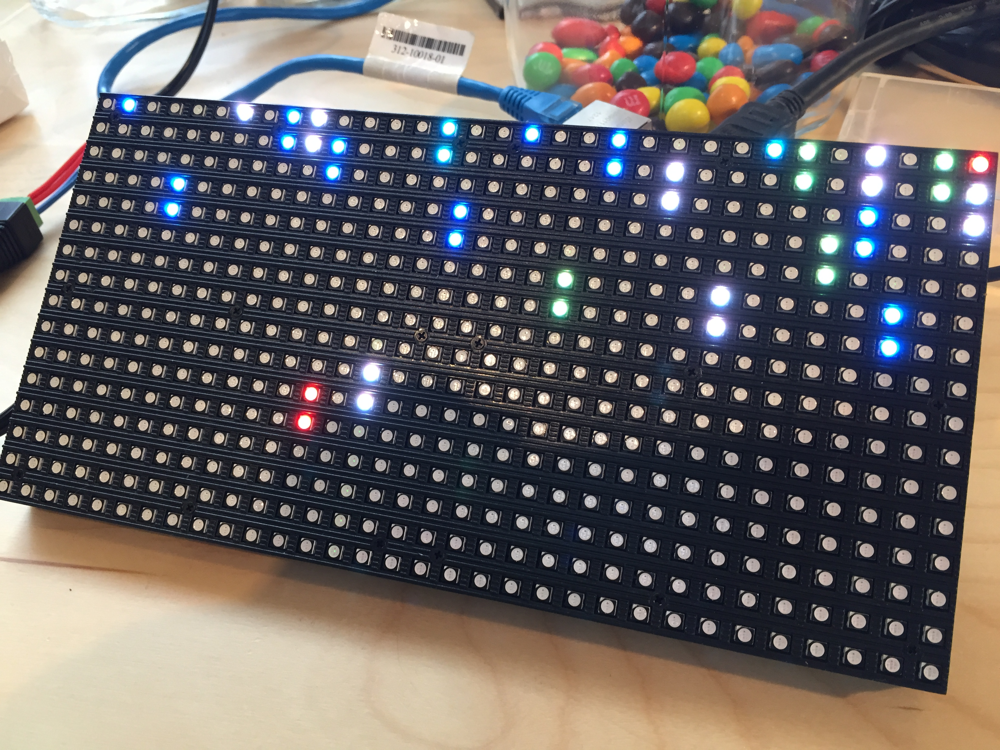
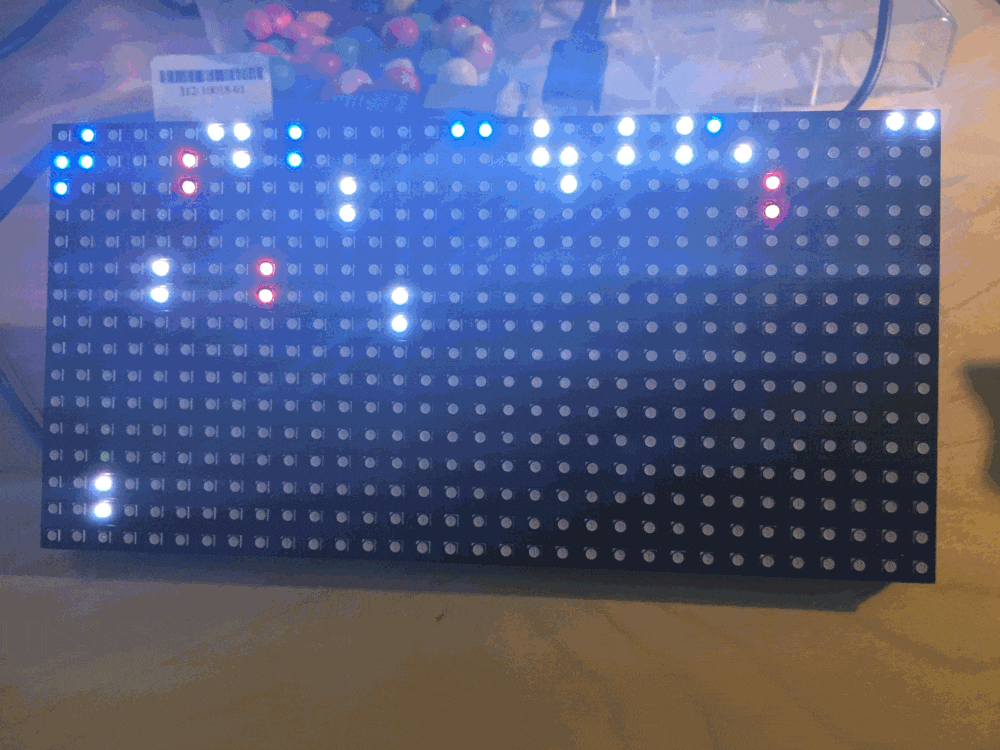

<h3 align="center">
  <a href="https://github.com/KrauseFx/fastlane">
    
     
    fastlane
  </a>
</h3>

  <a href="https://github.com/KrauseFx/deliver">deliver</a> &bull; 
  <a href="https://github.com/KrauseFx/snapshot">snapshot</a> &bull; 
  <a href="https://github.com/KrauseFx/frameit">frameit</a> &bull; 
  <a href="https://github.com/KrauseFx/PEM">PEM</a> &bull; 
  <a href="https://github.com/KrauseFx/sigh">sigh</a> &bull; 
  <a href="https://github.com/KrauseFx/produce">produce</a> &bull; 
  <a href="https://github.com/KrauseFx/cert">cert</a> &bull; 
  <a href="https://github.com/KrauseFx/codes">codes</a>

-------

Rocket launcher for fastlane
============================

Visualize fastlane usage as rockets 🚀

Every time one of the [fastlane tools](https://fastlane.tools) is launched, a rocket will be launched from the bottom of the LED board in the color of the corresponding tool.

All you need is a Raspberry PI and a [LED Board](https://learn.adafruit.com/connecting-a-16x32-rgb-led-matrix-panel-to-a-raspberry-pi/you-will-need).

Each tool looks for updates when it's launched. The update checker is also open source as [refresher](https://github.com/fastlane/refresher).

## Building the LED Board

[adafruit](https://learn.adafruit.com/connecting-a-16x32-rgb-led-matrix-panel-to-a-raspberry-pi/you-will-need) shows a step by step guide what to buy and how to connect the board to get the LED Board running.

Costs for the LED board around 55 Euro.

## Starting the script

    sudo ruby server.rb

The `sudo` is required, as the LED displays requires `sudo` privileges. 

This will use the c program under the hood to control the LED display.

# fastlane

This project is part of the [fastlane](https://fastlane.tools) toolchain. 

##### [Like what we're doing? Be the first to know about updates and new fastlane tools](https://tinyletter.com/krausefx)
